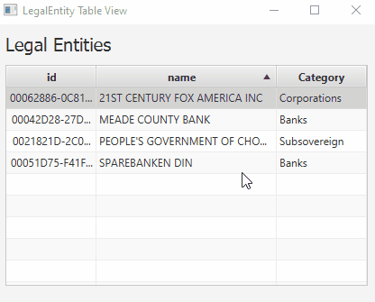

# Prototyping dockerized microservices with (JavaFX + SpringBoot + JPRO + Java 11)

* This project enables prototyping of microservices stack. You will find many independent modules inside which are fully independent from each other. But they have one thing in common and this is the technology stack used to implement UI and serivces
* For ease of prototyping, JavaFx and Spring Boot framework run in the same JVM. That means that JavaFx UI and Spring Boot Server are packed in one ```mdm-client``` project (integration of JavaFx with Spring Boot beans is enabled by [FxWeaver library](https://rgielen.net/posts/2019/introducing-fxweaver-dependency-injection-support-for-javafx-and-fxml/)). In production, you can easily split into two independent modules (you can keep the Spring Boot server and you can implement UI in some popular WEB framework (and maybe even keep JavaFx Desktop application at the same time)). Splitting of modules is easy thanks to the loose coupled communication between JavaFx UI and Spring controllers. The servicese are injected into JavaFx ui as Spring beans and any events produced by Spring Services are observed and consumed in JavaFx in a reactive (decoupled) way thanks to RxJava and RxJavaFx frameworks. Both approaches enables easy split.
* Moreover, JavaFx UI is possible to run from withing WEB browser (optionally), thanks to [JPro framework](https://www.jpro.one/). This also enables to dockerize the mdm-client module, which brings another possibilities by prototyping (testing scalability, ressilience in k8S or Swarm cluster....)


## [How to run JavaFx client as desktop or in web browser](doc/howToRunJavaFxClient.md)

## List of projects
* ### [Simple read-only view of one DB table](starter_READ_only_from_postgres_no_rxJava/Readme.md)
